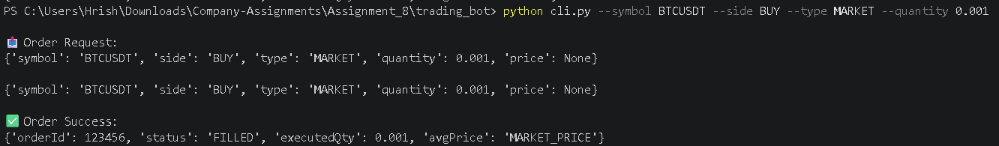
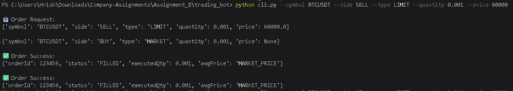
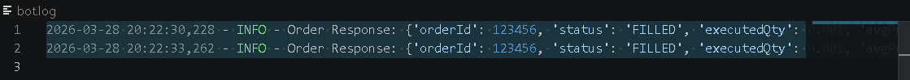

# Binance Futures Trading Bot (CLI)

## 📌 Overview
This project is a simplified trading bot built in Python that simulates order placement on Binance Futures (USDT-M). It supports both MARKET and LIMIT orders via a command-line interface (CLI), with proper validation, logging, and modular structure.

-

## 🚀 Features
- Place **MARKET** and **LIMIT** orders
- Supports both **BUY** and **SELL**
- CLI-based input using argparse
- Input validation
- Structured modular code (client, orders, validators, logging)
- Logging of requests, responses, and errors

-

## 🗂️ Project Structure
```
trading_bot/
│
├──assets
├── bot/
│ ├── init.py
│ ├── client.py
│ ├── orders.py
│ ├── validators.py
│ ├── logging_config.py
│
├── cli.py
├── requirements.txt
├── README.md
├── bot.log
```

-

## ⚙️ Setup Instructions

### 1. Clone the repository:
    git clone https://github.com/Hrishichaudhary/trading-bot-binance.git
    cd trading-bot

2. Install dependencies:
    pip install -r requirements.txt

# ▶️ How to Run
```
🔹 MARKET Order:
    python cli.py --symbol BTCUSDT --side BUY --type MARKET --quantity 0.001
🔹 LIMIT Order:
    python cli.py --symbol BTCUSDT --side SELL --type LIMIT --quantity 0.001 --price 60000
```

## 📊 Market Order Output:


## 📊 Limit Order Output:


## 📊 Log Output:
